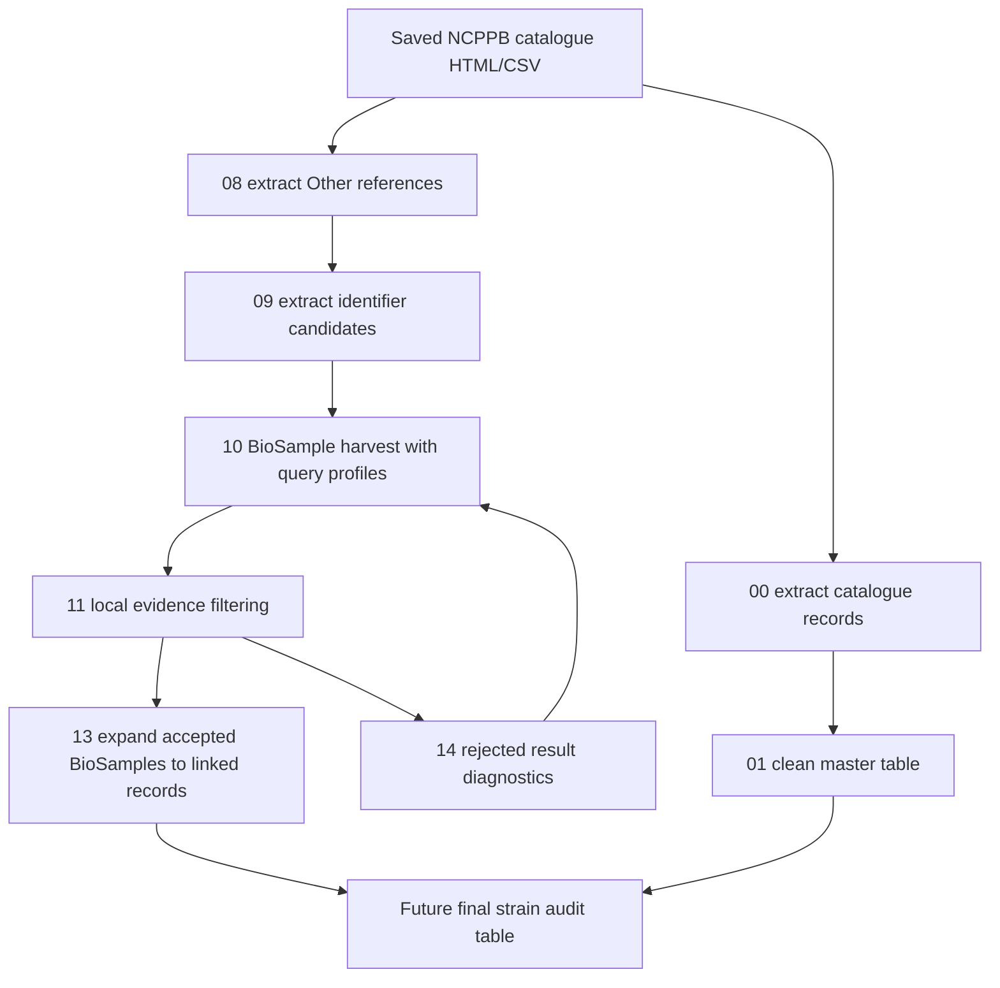

# Current NCPPB Workflow Deep Dive And Completion Plan

本文档详细说明当前 NCPPB Xanthomonas genome audit 项目中的脚本目的、代码逻辑、输入输出、中间数据和结果文件，并把当前状态与 proposal 中承诺的最终交付物逐项对照。它也记录下一步如何扩展到 NCBI BioSample、SRA、BioProject、Assembly、Taxonomy 等 linked datasets，以及如何改进 raw data 之后的筛选策略和 `Other references` 编码提取策略。

当前日期：2026-06-01。

## 1. Proposal 对最终项目的要求

proposal 的核心目标不是单纯下载 NCBI 数据，而是建立一个可复跑、可解释、可审计的 workflow，用来回答每个 NCPPB Xanthomonas strain 是否能被可靠地连接到公共 genomic records。

proposal 中明确承诺的最终输出包括：

- `strain-by-strain audit table`：每个 NCPPB strain 一行，记录是否有可靠 linked public records。
- `summary statistics and figures`：全 collection 层面的统计和图表。
- `documented script`：可在未来 NCBI 新记录出现或 taxonomy 更新后重新运行。
- `intermediate matching tables`：保留查询、候选、筛选、匹配证据，保证决策可追溯。
- `decision table`：把每个 NCPPB strain 与最相关 NCBI records 连接，并分配 audit category。

proposal 中定义的主要 audit categories 是：

- `complete_genome_available`
- `chromosome_level_assembly_available`
- `scaffold_or_contig_level_assembly_available` / `draft_assembly_available`
- `reads_only`
- `no_confidently_linked_public_sequence_data`
- `ambiguous_case_needing_curator_review`

proposal 中定义的匹配原则是：

- 优先使用 accession / collection number 证据。
- name matching 只能在 accession evidence 缺失或不清晰时作为辅助。
- broader organism-name search 只能作为最后 fallback，因为它容易返回不是目标 strain 的记录。
- BioSample、SRA、Assembly、Taxonomy 需要作为 linked record set 一起解释。
- Taxonomic name mismatch 不应简单视为错误，而应区分 historical name、taxonomy revision、metadata inconsistency 和 truly ambiguous case。

因此，最终项目必须同时完成两件事：

1. 产生一个对 NCPPB Xanthomonas collection 有实际意义的全量审计结果。
2. 证明这个结果是由可复跑脚本和可解释规则生成的，而不是一次性手工搜索。

## 2. 当前项目完成程度

当前仓库已经不是空项目，主要 BioSample identifier workflow 已经跑到了全量 Xanthomonas collection。

当前关键事实：

| 项目 | 当前结果 |
|---|---:|
| NCPPB Xanthomonas master rows | 898 |
| `Other references` rows | 898 |
| 旧版 identifier candidate rows | 1,657 |
| 旧版 identifiers included for search | 1,464 |
| 新 strict policy identifiers included for search | 1,027 |
| 旧版 raw BioSample candidate rows | 33,829 |
| accepted BioSample rows | 612 |
| unique strains with accepted BioSample match | 370 |
| review/rejected rows | 33,217 |
| non-Xanthomonas rejected rows | 31,827 |
| linked BioSample rows expanded by script 13 | 552 |
| strains with linked-record rows | 370 |
| strains with linked SRA evidence in current linked table | 326 |
| strains with linked BioProject evidence in current linked table | 352 |

当前最重要的结论：

- BioSample strain-level matching 已经有可用初版结果：370/898 strains 有 strict accepted BioSample match。
- 旧检索策略存在严重 precision 问题：大量 `Other references` 短编码使用 `[All Fields]` 后命中 human、metagenome、mouse、environmental sample 等无关 BioSample。
- 现在已经新增 `script 14` 对 rejected result 做可复现诊断，这是导师要求的关键下一步。
- 当前还没有完成 proposal 要求的最终 strain-by-strain audit table，因为 Assembly completeness、SRA read-only status、Taxonomy consistency、final category 和 figures 还未完全整合。

## 3. 推荐主线工作流

当前推荐主线不再使用早期 Week 2 broad search 作为最终逻辑，而是使用 identifier-first workflow。



推荐当前主线脚本是：

1. `00_extract_ncppb_html.py`
2. `01_clean_ncppb_catalogue.py`
3. `08_html_to_other_references.py`
4. `09_extract_other_reference_identifiers.py`
5. `10_harvest_biosample_raw.py`
6. `11_filter_biosample_raw.py`
7. `14_analyze_biosample_rejections.py`
8. `13_link_biosample_related_records.py`
9. 未来需要新增 final audit table builder。

早期 `02_make_search_terms.py`、`03_ncbi_smoke_test.py`、`03_ncbi_harvest_candidates.py`、`04_ncbi_classify_candidates.py`、`05_ncbi_group_record_sets.py` 仍然有历史和测试价值，但它们现在更像 Week 2 / Week 3 pilot workflow 的残留，不应作为最终唯一主线，除非被重构进新的 pipeline。

## 4. 数据目录和结果文件

### 4.1 Raw data

| 文件 | 行数 | 作用 |
|---|---:|---|
| `data/raw/ncppbresult.html` | NA | 浏览器保存的 NCPPB Xanthomonas search result page，是当前 catalogue source evidence。 |
| `data/raw/ncppbresult_original.html` | NA | 原始 HTML 备份。 |
| `data/raw/ncppbresult_reconstructed.html` | NA | 从 Chrome view-source 保存格式重建后的 HTML。 |
| `data/raw/ncppb_catalogue.csv` | 898 | 从 HTML 抽取出来的 raw catalogue table。 |
| `data/raw/ncppb_import_instructions.md` | NA | 说明为什么需要手动保存网页，以及如何导入。 |

重要限制：NCPPB catalogue 页面可能依赖浏览器 session，直接 scripted download 可能失败或返回 403。因此 raw HTML/CSV 必须保留，不能只保留清洗后的表。

### 4.2 Processed and interim data

| 文件 | 行数 | 作用 |
|---|---:|---|
| `data/processed/ncppb_xanthomonas_master.csv` | 898 | 当前项目的 master table。 |
| `data/interim/search_terms.tsv` | 5,394 | 早期 broad search term 表。现在更多是历史/对照用途。 |
| `data/interim/ncppb_html_keyword_audit.tsv` | 10,146 | 从 NCPPB HTML 提取的 long-format visible keyword audit，用于检查是否漏掉 catalogue 字段。 |

### 4.3 Current BioSample pipeline results

| 文件 | 行数 | 作用 |
|---|---:|---|
| `results/refactored_pipeline/01_other_references.tsv` | 898 | 每个 strain 的 `Other references` text。 |
| `results/refactored_pipeline/02_other_reference_identifiers.tsv` | 1,657 | 旧 policy 下的 identifier candidates。 |
| `results/refactored_pipeline/03_biosample_raw_all.tsv` | 33,829 | 旧 query strategy 下从 BioSample harvest 得到的 raw candidates。 |
| `results/refactored_pipeline/04_biosample_matches_all.tsv` | 612 | 自动 accepted BioSample matches。 |
| `results/refactored_pipeline/04_biosample_review_all.tsv` | 33,217 | 未自动接受的 rows，包括 clear rejects、no hit、taxon-only、conflicts。 |
| `results/refactored_pipeline/05_linked_records_all.tsv` | 552 | accepted BioSamples 扩展到 SRA/BioProject/BioCollections 的 linked table。 |

### 4.4 Rejected-result diagnostic outputs

| 文件 | 行数 | 作用 |
|---|---:|---|
| `analysis_tmp/biosample_rejection_diagnostics/02_other_reference_identifiers_strict_policy.tsv` | 1,657 | 新 strict extraction policy 的 identifier candidate table。保留同样候选，但只让 1,027 个进入默认 search。 |
| `analysis_tmp/biosample_rejection_diagnostics/rejection_counts_by_reason.tsv` | 53 | 按 reject reason 汇总。 |
| `analysis_tmp/biosample_rejection_diagnostics/prefix_noise_summary.tsv` | 235 | 按 prefix 统计噪声和 accepted productivity。 |
| `analysis_tmp/biosample_rejection_diagnostics/search_term_productivity.tsv` | 2,345 | 每个 query/search term 的 accepted vs rejected productivity。 |
| `analysis_tmp/biosample_rejection_diagnostics/strain_rejection_summary.tsv` | 898 | 每个 strain 的 rejected burden。 |
| `analysis_tmp/biosample_rejection_diagnostics/manual_review_priority_candidates.tsv` | 148 | 需要人工优先审阅的 taxon-only/conflicting/probable candidates。 |

最关键的 rejected-result 发现：

- `non_xanthomonas_organism`: 31,827 rows，覆盖 508 target strains。
- `query_returned_no_biosample_records`: 1,242 rows。
- `taxon_level_only`: 69 rows，覆盖 7 target strains。
- conflicting NCPPB numbers 是小数量但高价值人工审阅项。
- `B` prefix 是最大噪声源：9,860 review rows，只对应 2 accepted rows。
- `X`、`XP`、`S`、`PATEL`、`XC`、`ENA` 等也需要审阅 query policy。

## 5. Script-by-script 深度说明

### 5.1 `scripts/00_extract_ncppb_html.py`

目的：把保存下来的 NCPPB result page HTML 转成 raw catalogue CSV。

输入：

- `data/raw/ncppbresult.html`

输出：

- `data/raw/ncppb_catalogue.csv`

主要代码逻辑：

- `reconstruct_if_view_source()`：如果 HTML 是 Chrome `view-source:` 保存格式，页面会被包在 `td.line-content` 中。该函数先把这些 line cells 还原成真实 HTML。
- `parse_records()`：寻找 `furtherinfo.cfm?ncppb_no=` links。每个 link 对应一个 NCPPB record。
- 对每个 record：
  - 从 link text 或 URL 中标准化 `NCPPB 1234`。
  - 从 header row 中取 `current_name`。
  - 从 nested detail row 中寻找 `<strong>label:</strong>`，通过 `LABEL_MAP` 映射到标准列。
  - 从 `other_references`、`notes`、`alternative_names` 中用 `COLLECTION_ID_RE` 抽取 known culture collection IDs。
  - 保存 `raw_record_text`，用于后续追溯。
- 最后 drop duplicate `ncppb_number`，按输出列写 CSV。

重要输出列：

- `ncppb_number`
- `current_name`
- `name_as_received`
- `alternative_names`
- `host`
- `country`
- `other_collection_numbers`
- `catalogue_sequence_links`
- `other_references`
- `notes`
- `raw_record_text`

风险和注意点：

- HTML 结构不是规则矩形表，而是 header row + nested detail row。任何 NCPPB 页面模板改变都可能影响解析。
- 当前 parser 是围绕已保存页面设计的，不保证能直接下载 live NCPPB 页面。
- `other_collection_numbers` 只覆盖 known prefixes，不能替代后面的 `Other references` full extraction。

### 5.2 `scripts/01_clean_ncppb_catalogue.py`

目的：把 raw catalogue CSV 清洗成项目 master table。

输入：

- `data/raw/ncppb_catalogue.csv`

输出：

- `data/processed/ncppb_xanthomonas_master.csv`

主要代码逻辑：

- `COLUMN_ALIASES` 允许输入文件列名有不同写法，如 `ncppb no.`、`accession number`、`catalogue name`。
- `map_columns()` 根据 aliases 把 raw columns 映射到固定 `MASTER_COLUMNS`。
- `standardise_ncppb()` 把 `101`、`NCPPB101` 等统一为 `NCPPB 101`。
- `compact_ncppb()` 生成 `NCPPB101` 这种 compact field。
- `extract_pathovar()` 从 current name 中抽取 `pv.` 信息。
- drop duplicate `ncppb_number` 并按数字排序。

当前结果：

- `data/processed/ncppb_xanthomonas_master.csv` 有 898 rows。

注意点：

- 该脚本只做格式标准化，不应该删除 historical names 或 uncertain metadata。
- proposal 要求保留 naming history，因此 `name_as_received`、`alternative_names`、`raw_record_text` 都应保留到最终 audit table 的 traceability layer。

### 5.3 `scripts/02_extract_html_keyword_audit.py`

目的：质量控制辅助脚本，把 NCPPB HTML 中所有 visible labelled values 抽成 long TSV。

输入：

- `data/raw/ncppbresult.html`

输出：

- `data/interim/ncppb_html_keyword_audit.tsv`

主要代码逻辑：

- 自定义 `HTMLParser` 读取 HTML table structure。
- 对每个 NCPPB record，保留每个 visible label/value pair。
- 对未映射 label 也保留为 `unexpected_label` 等 normalized label。
- 额外提取 collection identifier rows。

用途：

- 检查 `00_extract_ncppb_html.py` 是否漏掉了某些网页字段。
- 如果 NCPPB 页面新增字段，这个 long table 能比 master schema 更早发现变化。

### 5.4 `scripts/02_make_search_terms.py`

目的：早期 broad search term generator。

输入：

- `data/processed/ncppb_xanthomonas_master.csv`

输出：

- `data/interim/search_terms.tsv`

主要代码逻辑：

- 对每个 strain 生成 `ncppb_number`、`ncppb_number_compact`、current name + NCPPB number、received name + NCPPB number、alternative names + NCPPB number、other collection numbers 等 search terms。

当前状态：

- 这是 Week 1/Week 2 逻辑，现在不应作为最终 BioSample harvest 的默认输入。
- 原因是 name-based 或 broad terms 会产生大量 taxon-level hits，不适合直接证明 strain identity。

仍然有用的地方：

- 可作为 fallback/manual review 的 search dictionary。
- 可用于 proposal 中提到的 current name、historical name、synonym review，但不应自动接受结果。

### 5.5 `scripts/03_ncbi_smoke_test.py`

目的：早期一体化 pilot/smoke-test script，用 identifier-first 的方式搜索 BioSample，并包含较多 core matching functions。

输入：

- `data/interim/search_terms.tsv` 或 master table。

输出：

- `results/week2_ncbi_smoke_test.tsv` 等早期结果。

主要代码逻辑：

- 定义 `StrainContext`，把每个 strain 的 NCPPB number、current name、other references、identifiers 打包。
- `collection_identifiers_from_text()` 和相关 regex 从 text 中抽取 known culture collection identifiers。
- `classify_candidate()` 判断 metadata 是否包含 exact NCPPB number、equivalent collection number、conflicting NCPPB number、non-Xanthomonas organism 或 taxon-only evidence。
- `build_harvest_keywords()` 限制搜索关键词为 strain-level identifiers，不使用 broad species/pathovar terms。
- `flatten_biosample()`、`flatten_assembly()`、`flatten_sra()` 将 NCBI summaries 统一成 row metadata。
- `linked_sra_rows()` 能把 BioSample 连接到 SRA rows。

当前状态：

- 它包含很多仍有价值的 core functions 和 tests，但现在主线 BioSample workflow 已被拆成 `08/09/10/11/13/14`。
- 未来可以把其中仍有价值的 `flatten_assembly()`、`flatten_sra()`、classification logic 抽成 shared module，避免 duplicated logic。

### 5.6 `scripts/03_make_biosample_query_plan.py`

目的：生成 pilot strains 的 planned BioSample queries，便于人工审阅检索计划。

输入：

- search terms table
- master table
- `--limit-strains`

输出：

- `results/week3_ncbi_biosample_query_plan_30.tsv`

主要代码逻辑：

- 载入 `03_ncbi_smoke_test.py` 作为 core module。
- 按 strain order 选取前 N 个 strains。
- 对每个 strain 构造 harvest keywords 和 query terms。

当前状态：

- 适合 pilot review，不是最终全量 query generator。
- 新的 query profile 逻辑已经在 `10_harvest_biosample_raw.py` 中实现，未来应把 query plan 功能迁移到 script 10 或一个 shared query builder。

### 5.7 `scripts/03_ncbi_harvest_candidates.py`

目的：早期网络 harvest step，从 NCBI BioSample 抓 raw candidate rows。

输入：

- master table / search terms / selected strains。

输出：

- `results/week3_ncbi_raw_candidates_30.tsv` 等。

主要代码逻辑：

- 载入 `03_ncbi_smoke_test.py` core。
- 对每个 query 调 ESearch/ESummary。
- 写出 raw metadata，不做 final accept/reject。

当前状态：

- 历史逻辑。新的主线网络 harvest 是 `scripts/10_harvest_biosample_raw.py`。

### 5.8 `scripts/04_ncbi_classify_candidates.py`

目的：早期 local classification step，把 raw candidates 分成 accepted matches 和 review candidates。

主要代码逻辑：

- `classify_raw_row()` 复用 core classification。
- `promote_rows_linked_to_accepted_biosamples()`：如果某个 non-BioSample row linked to accepted BioSample，并且没有 conflicting NCPPB number 或 non-Xanthomonas organism，则可提升为 accepted linked row。

当前状态：

- 历史逻辑，但其中的 linked promotion concept 很重要。
- 新主线 `script 11` 目前只处理 BioSample raw rows；未来如果重新纳入 Assembly/SRA direct raw rows，应恢复类似 promotion 逻辑。

### 5.9 `scripts/05_ncbi_group_record_sets.py`

目的：把 accepted NCBI matches 聚合成 BioSample-centred record sets，并生成 pilot strain summary。

输入：

- accepted matches table
- review table
- master table
- strain order table

输出：

- `results/week3_ncbi_record_sets_30.tsv`
- `results/week3_ncbi_strain_summary_30.tsv`

主要代码逻辑：

- `record_set_key()` 优先使用 BioSample accession 作为 record set ID。
- `assembly_category()` 根据 assembly level、has SRA、has BioSample 分配 category。
- `group_matches()` 将同一 strain + same BioSample 的 BioSample/Assembly/SRA rows 聚在一起。
- `strain_summary()` 输出每个 selected strain 的 best category 和 review counts。

当前状态：

- 该脚本的 final-category 思路很符合 proposal。
- 但它目前主要用于 pilot 30 strains，并依赖输入中已经有 Assembly/SRA rows。当前 refactored full pipeline 的 `05_linked_records_all.tsv` 没有 assembly columns，因此还不能直接生成完整 proposal category。

需要做：

- 改造为 final audit builder，支持 `05_linked_records_all.tsv` 的 SRA/BioProject 信息，也支持未来 Assembly linked table。
- 输出 898-row final audit table。

### 5.10 `scripts/06_prepare_other_reference_llm_audit.py`

目的：为 LLM/manual audit 准备 `Other references` identifier extraction review package。

主要代码逻辑：

- 载入早期 core。
- 对每个 strain 输出 source text、script-extracted identifiers、query terms、comparison template。

当前状态：

- 用于验证 `Other references` extraction 是否漏掉 identifier。
- 不应作为最终自动化的一部分，但它可用于建立 gold standard。

### 5.11 `scripts/07_compare_other_reference_llm_audit.py`

目的：把 LLM/human-filled review 与 script-extracted identifiers 比较。

主要代码逻辑：

- `normalize_identifier()` 标准化 identifier。
- `split_identifier_list()` 把分号/换行分隔的 identifiers 转成 set。
- 对每个 strain 输出 missing/extra/verdict。

当前状态：

- 适合用来评估 extraction recall 和 precision。
- 未来最好和 `script 12` 合并，避免两个相似 comparison scripts 并存。

### 5.12 `scripts/08_html_to_other_references.py`

目的：从 NCPPB HTML 中只抽取 `ncppb_number` 和 `Other references`。

输入：

- `data/raw/ncppbresult.html`

输出：

- `results/refactored_pipeline/01_other_references.tsv`

主要代码逻辑：

- `reconstruct_if_view_source()` 处理 Chrome view-source 保存格式。
- `parse_other_reference_rows()` 查找每个 `furtherinfo.cfm?ncppb_no=` link，并在该 record block 中查找 `Other references:` field。
- 输出一行一个 strain。

当前结果：

- 898 rows。

注意点：

- 该脚本比 `00` 更专注，适合作为 `Other references` extraction 的稳定入口。
- 如果 NCPPB HTML 结构变化，应先用 `02_extract_html_keyword_audit.py` 检查 label 是否仍然可见。

### 5.13 `scripts/09_extract_other_reference_identifiers.py`

目的：从 `Other references` free text 中提取可能的 strain-level identifiers。

输入：

- `results/refactored_pipeline/01_other_references.tsv`

输出：

- `results/refactored_pipeline/02_other_reference_identifiers.tsv`
- strict policy diagnostic output: `analysis_tmp/biosample_rejection_diagnostics/02_other_reference_identifiers_strict_policy.tsv`

主要代码逻辑：

- `KNOWN_COLLECTION_PREFIXES` 定义高可信 culture collection prefixes，例如 `ATCC`、`CFBP`、`ICMP`、`LMG`、`DSM`。
- `KNOWN_PREFIX_RE` 优先匹配 known collection prefixes。
- `GENERAL_CODE_RE` 匹配一般 `PREFIX NUMBER` 样式。
- `EMBEDDED_CODE_RES` 处理一些嵌入式编码，例如 slash/hyphen 结构。
- `classify_candidate()` 根据 prefix、context、known prefix、是否 single-letter、是否像 person/local reference，给出：
  - `rule_name`
  - `confidence`
  - `include_for_search`
- `query_from_identifier()` 生成 BioSample query hint。新版使用 `[Text Word]`，不再默认使用 `[All Fields]`。

当前新版策略：

- known collection prefix: `high`, `include_for_search=yes`
- contextual reference code: `medium`, `include_for_search=yes`
- uppercase general code: `medium`, `include_for_search=yes`
- source-context single-letter code: `low`, `include_for_search=no`
- person/local reference code: `low`, `include_for_search=no`
- general low-confidence code: `low`, `include_for_search=no`
- stopword prefix: `reject`, `include_for_search=no`

为什么这样改：

- rejected diagnostics 显示旧策略中 low-confidence short codes 是最大噪声来源。
- 例如 `B[All Fields] AND 67[All Fields]` 会命中大量无关 records。
- 新策略仍保留这些 identifiers 作为 evidence，但默认不送入 NCBI search。

当前 strict policy 结果：

- 总候选仍是 1,657 rows。
- `include_for_search=yes` 从旧版 1,464 降到 1,027。
- 这不会删除证据，只是减少默认检索噪声。

### 5.14 `scripts/10_harvest_biosample_raw.py`

目的：用 prepared identifiers 搜索 NCBI BioSample，并输出 raw candidate rows。

输入：

- `script 09` 输出的 identifier table。

输出：

- raw BioSample candidate TSV。

主要代码逻辑：

- `QUERY_PROFILES` 定义检索模式：
  - `strict_xanthomonas`
  - `known_collection_strict`
  - `current_all_fields`
  - `broad_review`
- `query_from_parts()` 根据 query profile 生成搜索语句。
- `strict_xanthomonas`：`PREFIX[Text Word] AND NUMBER[Text Word]` 加 `Xanthomonas[Organism]`。
- `known_collection_strict`：只允许 high-confidence known collection prefix rows。
- `current_all_fields`：保留旧 `[All Fields]` 逻辑，只用于复现旧结果和比较。
- `broad_review`：使用 `[Text Word]` 但不加 organism filter，用于 suspected false-negative review。
- `EntrezClient` 调 ESearch 和 ESummary。
- 新增 `--cache-dir`：缓存 NCBI JSON，避免重复请求。
- 新增 `--resume`：如果 output 已有某些 query/profile/search_term rows，则跳过已完成 query。
- raw output 新增 diagnostic columns：
  - `query_profile`
  - `rule_name`
  - `confidence`
  - `target_organism_filter`
  - `count_returned`
  - `ids_fetched`
  - `retmax_saturated`

推荐当前命令示例：

```bash
python scripts/10_harvest_biosample_raw.py   --input analysis_tmp/biosample_rejection_diagnostics/02_other_reference_identifiers_strict_policy.tsv   --output results/refactored_pipeline/03_biosample_raw_strict_xanthomonas.tsv   --query-profile strict_xanthomonas   --target-organism Xanthomonas   --cache-dir analysis_tmp/ncbi_cache   --resume   --api-key "$NCBI_API_KEY"
```

注意点：

- `strict_xanthomonas` 会大幅减少 non-Xanthomonas false positives，但可能漏掉 NCBI organism label 错误的真实 strain records。
- 所以不应只用 strict profile 判定 no data。对 no-hit 或 high-value strains，应跑 `known_collection_strict` 和 targeted `broad_review` fallback。

### 5.15 `scripts/11_filter_biosample_raw.py`

目的：对 raw BioSample candidates 做本地 evidence filtering，分成 accepted matches 和 review/reject rows。

输入：

- raw BioSample table。
- identifier table。

输出：

- accepted matches table。
- review/reject table。

主要代码逻辑：

- `build_patterns()` 为每个 NCPPB strain 构造 exact regex patterns：
  - NCPPB number pattern，例如 `NCPPB 45`、`NCPPB45`、`NCPPB:45`。
  - `Other references` identifier patterns，例如 `LMG 673`、`ICMP 204`。
- `classify_row()` 是核心决策函数：
  - `status=no_hit` -> `no_public_data_found` / `no_data`
  - query error -> review
  - metadata 中出现 conflicting NCPPB number -> reject
  - organism 非 Xanthomonas 且没有 strong identifier -> reject
  - organism 非 Xanthomonas 但有 strong identifier -> review，不自动 reject
  - exact NCPPB number -> accept
  - known collection prefix identifier -> accept
  - local/donor identifier only -> review
  - Xanthomonas organism 但无 exact identifier -> taxon-level-only review
- `evidence_score` 用于表达证据强度：NCPPB number 最高，known collection prefix 高，其他 lower confidence。

当前结果：

- 旧 raw data 过滤后 accepted rows: 612。
- unique accepted strains: 370。
- review/rejected rows: 33,217。

重要原则：

- NCBI query hit 不等于 strain match。
- accepted 必须依赖 metadata 中的 exact strain-level identifier。
- 对 strong identifier + non-target organism 的情况，不应自动 reject，因为可能是 NCBI taxonomy/organism label 错误，应进入 manual review。

### 5.16 `scripts/12_compare_identifier_extraction_to_llm.py`

目的：比较 `script 09` 提取结果和人工/LLM review 的 expected identifiers。

输入：

- identifier extraction table。
- LLM/human-filled review table。

输出：

- comparison table with missing/extra/verdict。

主要代码逻辑：

- 只比较 `include_for_search=yes` 的 extracted identifiers。
- 标准化 identifiers 后做 set difference。

注意点：

- 现在 low-confidence identifiers 被保留但默认不搜索，因此这个 script 如果只比较 included identifiers，可能会把保留但不搜索的 codes 当成 missing。未来应增加两套比较：
  - `extracted_all_identifiers`
  - `included_for_search_identifiers`

### 5.17 `scripts/13_link_biosample_related_records.py`

目的：从 accepted BioSample matches 出发，扩展 linked SRA、BioProject、BioCollections records。

输入：

- `results/refactored_pipeline/04_biosample_matches_all.tsv`

输出：

- `results/refactored_pipeline/05_linked_records_all.tsv`

主要代码逻辑：

- `selected_biosample_rows()` 只选择 `evidence_level=strong_strain_match` 的 accepted BioSample rows。
- `resolve_biosample_uid()` 确保每个 BioSample accession 有 UID。
- `parse_biosample_summary()` 从 BioSample ESummary XML 中解析：
  - BioSample accession/title/organism/taxid
  - linked SRA sample IDs
  - linked BioProject IDs/accessions
  - culture collection terms
- `linked_ids()` 用 ELink 从 BioSample 找 SRA、BioProject、BioCollections linked IDs。
- `parse_sra_summaries()` 从 SRA summaries 中解析 experiment accessions、run accessions、library strategies、BioProject accession、SRA sample accession。
- `parse_bioproject_summaries()` 从 BioProject summaries 中解析 BioProject accession 和 title。
- `output_row()` 合并所有 linked evidence。

当前结果：

- 552 linked rows。
- 370 strains 有 linked rows。
- 326 strains 有 SRA evidence。
- 352 strains 有 BioProject evidence。
- 当前所有 linked rows status 都是 `ok`。

当前缺口：

- 该脚本还没有系统扩展 Assembly records。
- Proposal 明确要求区分 complete genome、draft assembly、raw reads、no public data，因此 Assembly linked expansion 是下一步必须补的部分。
- BioProject 是 project-level evidence，不能单独证明 strain identity；它只能作为 accepted BioSample 的 linked context。

### 5.18 `scripts/14_analyze_biosample_rejections.py`

目的：把 rejected/review result 变成可复现的数据分析，支撑 NCBI 检索参数优化。

输入：

- accepted matches table。
- review/rejected table。
- optional identifier table。

输出：

- `rejection_counts_by_reason.tsv`
- `prefix_noise_summary.tsv`
- `search_term_productivity.tsv`
- `strain_rejection_summary.tsv`
- `manual_review_priority_candidates.tsv`

主要代码逻辑：

- `enrich_row()` 用 identifier table 补全 review rows 中缺失的 rule/confidence/prefix metadata。
- `rejection_reason_summary()` 按 reject reason 统计。
- `prefix_summary()` 按 prefix 比较 review rows 和 accepted rows。
- `search_term_productivity()` 按具体 query term 计算 accepted/review productivity。
- `strain_summary()` 按 NCPPB strain 汇总 rejected burden。
- `manual_review_candidates()` 抽取高价值人工审阅项：
  - `P1_taxon_level_only_check`
  - `P2_conflicting_ncppb_number_check`
  - `P3_probable_identifier_check`

用途：

- 回答导师要求：先分析 rejected result，再优化 NCBI 检索参数。
- 找出应该禁用、降级或只作 broad fallback 的 prefixes/rules。
- 为人工审阅提供优先级，而不是让人看 33,217 rows。

## 6. NCBI linked datasets 的未来匹配设计

proposal 明确要求 BioSample、SRA、Assembly、Taxonomy 等 linked records 被组织为 record set。当前项目已经完成 BioSample-centered matching 的第一步，但 linked datasets 还需要更完整的数据模型。

### 6.1 为什么应以 BioSample 为中心

NCBI 官方说明中，BioSample 描述 biological source material；BioProject 是项目级容器；SRA 是 sequencing experiment/read archive；Assembly 是 assembled genome product。对 strain audit 来说，最可靠的起点通常是 BioSample，因为它最接近 physical isolate/sample metadata。

当前推荐原则：

- 先证明 BioSample 与 NCPPB strain 是同一个 biological material。
- 再从 accepted BioSample 扩展 SRA、Assembly、BioProject。
- 不要用 BioProject 或 broad SRA search 直接证明 strain identity，因为 project-level 或 experiment-level metadata 可能覆盖多个 samples。

### 6.2 Future linked-record table schema

建议新增一个统一 linked-record schema：

| 字段 | 含义 |
|---|---|
| `ncppb_number` | NCPPB strain ID。 |
| `record_set_id` | 优先用 BioSample accession。 |
| `biosample_accession` | Accepted BioSample。 |
| `biosample_uid` | NCBI UID。 |
| `biosample_organism` | BioSample organism string。 |
| `biosample_taxid` | BioSample TaxID。 |
| `matched_identifier` | 支持 match 的 identifier。 |
| `matched_identifier_type` | NCPPB number / known collection / linked evidence。 |
| `sra_experiment_accessions` | SRX/ERX/DRX。 |
| `sra_run_accessions` | SRR/ERR/DRR。 |
| `sra_library_strategy` | WGS、AMPLICON、RNA-Seq 等。 |
| `assembly_accessions` | GCA/GCF accessions。 |
| `assembly_level` | Complete Genome、Chromosome、Scaffold、Contig。 |
| `assembly_refseq_category` | representative/reference if available。 |
| `bioproject_accessions` | PRJNA/PRJEB/PRJDB。 |
| `taxonomy_name` | NCBI taxonomy scientific name。 |
| `taxonomy_rank` | species/subspecies/strain if available。 |
| `record_set_status` | ok/partial/error。 |
| `link_evidence` | Which ELink/XML fields created this link。 |

### 6.3 Dataset-specific matching policy

BioSample：

- 可作为 primary strain-level anchor。
- Accepted only when metadata contains exact NCPPB number or high-confidence equivalent collection number。
- Taxon-only BioSample remains review, not accepted。

SRA：

- 最好通过 accepted BioSample ELink 扩展。
- 记录 SRX/SRR、library strategy、platform、layout、BioProject。
- `WGS` reads support `reads_only` if no Assembly exists。
- Amplicon/RNA-Seq 不应被算作 genome representation，除非 project scope 明确需要。

Assembly：

- 必须补上。Proposal 的 complete/draft genome categories 依赖 Assembly。
- 应通过 accepted BioSample -> Assembly ELink 或 Assembly summaries 中的 BioSample accession 回连。
- 根据 `assembly_level` 分配：
  - Complete Genome -> `complete_genome_available`
  - Chromosome -> `chromosome_level_assembly_available`
  - Scaffold/Contig -> `draft_assembly_available`

BioProject：

- 作为 project context，不作为 strain identity anchor。
- 一个 BioProject 可能包含多个 samples，因此不能因为 BioProject title 包含 Xanthomonas 就接受某个 strain。
- 用于 summary、traceability、figures。

Taxonomy：

- 应记录 NCBI TaxID、scientific name、lineage。
- 目的不是强制 NCPPB name 与 NCBI name 完全一致，而是分类：
  - exact/compatible
  - historical synonym likely
  - taxonomy revision likely
  - inconsistent but same genus
  - non-target / needs curator review

BioCollections：

- 可辅助识别 culture collection accession，但目前 NCBI BioCollections links 并不一定能证明 strain identity。
- 应作为 metadata context，不应单独作为 accepted evidence。

## 7. Raw data 后筛选步骤：如何减少假阴性

当前 `script 11` 的优势是 precision 高，但 strict filtering 可能带来 false negatives。假阴性来源主要包括：

- NCBI metadata 中没有写 NCPPB number，也没有写 equivalent collection number。
- NCBI organism label 错误或过旧，strict `Xanthomonas[Organism]` 检索可能漏掉。
- Equivalent culture collection identifier 没有被 `Other references` extraction 捕获。
- Identifier 写法太复杂，如多个编号共享 prefix、slash/hyphen、前缀省略。
- SRA/Assembly 中有 BioSample link，但 BioSample metadata 本身不含足够 identifier。
- NCPPB catalogue 中 `catalogue_sequence_links` 或 notes 包含 sequencing evidence，但当前主线没有充分利用。

建议的改进策略：

### 7.1 把 accepted / no data / not searched 分开

不要把 no hit 直接解释为 no public sequence data。最终表应区分：

- `accepted_public_data_found`
- `candidate_found_but_not_accepted`
- `no_biosample_candidate_under_current_profile`
- `not_searched_due_low_confidence_identifier`
- `not_yet_checked_broad_fallback`

这样可以避免把 strict profile 的 no hit 当成 biological absence。

### 7.2 对 no-hit strains 做 second-pass fallback

对 strict profile 下 no-hit 的 strains，建议运行分层 fallback：

1. `known_collection_strict`：只搜索 high-confidence collection IDs。
2. `broad_review`：对 NCPPB number 和 high-value equivalent IDs 用 `[Text Word]`，不加 organism filter。
3. NCBI Assembly reverse lookup：搜索 GCA/GCF/Assembly by identifiers，并回连 BioSample。
4. SRA reverse lookup：搜索 SRA experiment/sample by identifiers，并回连 BioSample。
5. catalogue sequence links：解析 NCPPB catalogue 中已有 sequencing links。

这些 fallback 的结果只能进入 review queue，不能直接 accepted。

### 7.3 增加 evidence scoring，而不是二元 accept/reject

当前 `evidence_score` 已经存在，但 final decision 仍比较硬。建议扩大 scoring：

- +100 exact target NCPPB number in BioSample metadata。
- +90 known equivalent culture collection identifier in BioSample metadata。
- +70 exact target NCPPB number in linked Assembly/SRA metadata, linked back to BioSample。
- +50 compatible current/historical name plus host/country/date, but no strain identifier。
- -100 conflicting NCPPB number。
- -80 non-target organism unless strong identifier exists。
- -30 low-confidence local code only。

然后把结果分为：

- auto accept
- high-priority review
- low-priority review
- clear reject

### 7.4 对 strong identifier + non-Xanthomonas 保持 review

当前 `script 11` 已经做对了一件事：如果非 Xanthomonas record 中出现 strong identifier，不自动 reject，而是 `review_strong_identifier_non_target_organism`。这能避免因 NCBI taxonomy label 错误造成假阴性。

应继续保留这个规则，并在 manual review table 中提高优先级。

### 7.5 用 linked records 做 rescue，但不绕过 evidence

如果 Assembly 或 SRA metadata 包含 exact NCPPB number，但 BioSample metadata 较弱，应允许生成 `probable_linked_record_match`。但 accepted 前仍要确认：

- linked BioSample 是否唯一。
- Assembly/SRA 是否明确指向同一个 BioSample。
- 是否存在 conflicting NCPPB number。
- organism/taxid 是否至少同 genus 或有可解释的 taxonomy revision。

### 7.6 不要过度依赖 organism filter

`Xanthomonas[Organism]` 对减少 false positives 很有效，但它也可能造成 false negatives。建议：

- 默认 full run 使用 organism filter。
- 对 no-hit/high-priority strains 使用 broad fallback。
- final audit table 记录每个 candidate 来自哪个 query profile。

### 7.7 加入人工审阅抽样

为了证明 precision/recall，不应只看脚本输出。建议：

- 从 accepted matches 中抽样 30 条手动验证。
- 从 no-hit strains 中抽样 30 条手动 web search。
- 从 taxon-only candidates 全量审阅，因为只有 69 rows。
- 从 top noisy prefixes 中抽样确认规则是否应禁用。

## 8. `Other references` 编码提取：更好的写法

当前 `script 09` 是 regex-first extraction。它能快速覆盖大量 cases，但对复杂自然语言仍有风险。建议下一版改为 token/span-based parser。

### 8.1 当前问题

- Single-letter local code 容易误检，例如 `B 67`。
- Person names 或 references 容易被当成 identifiers，例如 `PATEL 10`。
- Some prefixes may be real in one context but noise in another context。
- `also in the collections; ICMP 204, LMG 673` 这种结构可以识别，但更复杂的 inherited-prefix list 可能漏掉。
- 年份、日期、实验编号、source labels 可能被误当 strain code。
- 当前 `include_for_search` 只有 yes/no，缺少 `why_excluded`、`risk_class`、`review_priority`。

### 8.2 建议的新 parser 架构

建议把 `script 09` 拆成四层：

1. Text normalization
   - 标准化 unicode dash、semicolon、comma、brackets。
   - 保留原始 span start/end，方便人工审阅。

2. Candidate generation
   - known collection prefix parser。
   - general code parser。
   - inherited prefix parser。
   - compact code parser，例如 `NBC5720` -> `NBC 5720`。
   - slash/hyphen parser，例如 `ARG-2B`、`B/67`。

3. Candidate classification
   - known collection ID。
   - donor/local code。
   - person/publication-like code。
   - source-only code。
   - date/year/noise。
   - uncertain。

4. Search policy assignment
   - `include_for_search=yes/no`
   - `query_profile_hint`
   - `confidence`
   - `exclusion_reason`
   - `manual_review_priority`

### 8.3 需要新增的规则

Known prefix expansion：

- 增加从 accepted matches 学习到的 productive prefixes。
- 为 `IBSBF`、`HACC`、`CECT`、`NZRCC`、`NCIMB` 等当前数据中出现的可能 culture collection prefixes 建立 review list。
- 把 known collection prefix list 放到 config file，而不是硬编码在 script 中。

Inherited prefix lists：

- `ICMP 204, 205, 206` 应生成 `ICMP 204`、`ICMP 205`、`ICMP 206`。
- `LMG 673 / 674` 应生成两个 LMG identifiers。
- `CFBP 2523 and 2533` 应生成两个 CFBP identifiers。

Noise exclusion：

- 年份范围：1900-2026 需要特殊判断，不能自动作为 suffix。
- 单字母 prefix 默认不搜索，除非它已经在 accepted gold set 中证明有价值。
- person-name-like prefix 默认不搜索。
- source context phrases 如 `isolated by`、`source of isolate` 附近的 code 默认降级。

Context scoring：

- `also in the collections`、`culture collection`、`accession` 附近加分。
- `donor reference` 附近中性或低分，视 prefix 而定。
- `isolated by`、`source of this isolate` 附近降分。
- `WGS`、`sequence`、`BioSample`、`Assembly`、`SRA` 附近加 review priority。

Gold standard evaluation：

- 使用 `results/llm_audit/other_reference_llm_vs_script_comparison.tsv` 和人工审阅结果作为 gold set。
- 分别报告 extraction recall、search-inclusion precision、missing productive IDs。

## 9. 目前还需要做什么

按 proposal 和当前代码状态，剩余任务如下。

### 9.1 先完成 query strategy validation

- 用新 strict policy 和 `strict_xanthomonas` profile 对 pilot set 重跑 BioSample。
- 与旧 `current_all_fields` accepted 结果比较：accepted strains 是否大幅减少。
- 对 no-hit 或 lost accepted strains 跑 `broad_review` fallback。
- 记录每个 query profile 的 candidate count、accepted count、review count。

### 9.2 人工审阅 rejected diagnostics

必须人工审阅：

- `manual_review_priority_candidates.tsv` 中所有 P1/P2 rows。
- `prefix_noise_summary.tsv` 中 top noisy prefixes。
- `search_term_productivity.tsv` 中 accepted_rows 高但 review_rows 也高的 terms。

审阅目标：

- 决定哪些 prefixes/rules 禁止默认搜索。
- 决定哪些 prefixes 加入 known collection config。
- 标记是否有 false negatives。

### 9.3 补 Assembly linked expansion

这是当前最重要的 proposal gap。

需要新增或扩展 `script 13`：

- BioSample -> Assembly ELink。
- Assembly ESummary parsing。
- Assembly accession、level、status、RefSeq/GenBank accession、BioProject、BioSample。
- 将 assembly category 传给 final audit table。

没有 Assembly，无法可靠区分 complete genome vs draft assembly vs reads only。

### 9.4 生成 final one-row-per-strain audit table

需要新增脚本，例如：

- `scripts/15_build_final_strain_audit.py`

输入：

- master table。
- accepted BioSample matches。
- linked records table。
- assembly linked table。
- rejected diagnostics/manual review flags。

输出：

- `results/final/ncppb_xanthomonas_strain_audit.tsv`

每行应包含：

- NCPPB catalogue fields。
- accepted BioSample accessions。
- SRA experiment/run accessions。
- Assembly accessions and levels。
- BioProject accessions。
- TaxID and NCBI organism names。
- best audit category。
- evidence level。
- manual review flag。
- query profile/run date。
- source URLs。

### 9.5 Taxonomy consistency module

proposal 明确提到要比较 NCPPB 和 NCBI names。

需要新增：

- NCBI Taxonomy lookup by TaxID。
- NCPPB current name vs NCBI organism string comparison。
- historical names / alternative names / pathovar parsing。
- category：`consistent`、`likely_taxonomic_revision`、`historical_name_match`、`same_genus_different_label`、`conflicting_taxon`、`insufficient_information`。

### 9.6 Summary statistics and figures

proposal 要求 summary statistics and simple figures。

建议生成：

- Audit category bar chart。
- Number of strains with BioSample/SRA/Assembly/BioProject。
- Assembly level distribution。
- Counts by species/pathovar/current name。
- Manual review burden by reason。
- Top sequencing gaps by taxonomic group。

### 9.7 Reproducibility and documentation

需要补：

- 一条完整 command recipe，从 raw HTML 到 final audit table。
- `run_date`、query profile、NCBI API settings、script version。
- `requirements.txt` 和 Python version。
- 数据字典更新，尤其是 final audit table。
- 明确哪些结果是 current old all-fields run，哪些是 strict rerun。

## 10. 推荐下一步执行顺序

1. 人工审阅 `analysis_tmp/biosample_rejection_diagnostics/` 中的诊断结果。
2. 用 strict policy 重跑 30-strain pilot，不覆盖旧结果。
3. 比较旧 accepted set 与 strict accepted set，列出 lost matches。
4. 对 lost/no-hit strains 跑 broad fallback。
5. 把 `script 13` 扩展到 Assembly。
6. 新增 final audit builder。
7. 新增 taxonomy consistency module。
8. 生成 final 898-row audit table。
9. 生成 summary tables and figures。
10. 写 dissertation methods/results 时引用 workflow、诊断表、manual review results。

## 11. 当前可引用的官方依据

- NCBI BioSample 页面说明 BioSample 描述 experimental assays 使用的 biological source materials，并给出 `Organism`、`Attribute Name`、`Attribute` 等字段检索示例：https://www.ncbi.nlm.nih.gov/biosample?Db=biosample
- NCBI SRA Entrez 文档说明可以利用 BioSample、BioProject 与 SRA 之间的 database connections 找到 linked SRA records：https://www.ncbi.nlm.nih.gov/sra/docs/srasearch/
- NCBI E-Utilities Quick Start 说明 ESearch、ESummary、ELink 的角色：ESearch 搜索数据库，ESummary 下载 summary，ELink 返回数据库内或数据库间 linked records：https://eutilities.github.io/site/Quick_Start/eu_quick/
- NCBI BioProject 页面说明 BioProject 是 biological data project container，并提供到 diverse data types 的 links：https://www.ncbi.nlm.nih.gov/bioproject?cmd=search

## 12. 关键风险

- Precision 与 recall tradeoff：严格 query profile 会减少 false positives，但可能增加 false negatives。
- Metadata incompleteness：NCBI BioSample/SRA/Assembly metadata 不一定包含 NCPPB 或 equivalent accession。
- Taxonomy drift：NCPPB current name 与 NCBI organism name 不一致时，不能简单按字符串判错。
- Query reproducibility：NCBI 数据每天都可能变化，必须记录 run date 和 query profile。
- Full NCPPB scalability：扩展到整个 NCPPB database 时不能 hard-code `Xanthomonas[Organism]`；必须支持 per-batch organism filter。

## 13. 当前最重要的判断

项目现在已经完成了一个有价值的 BioSample matching prototype，但还没有完成 proposal 中承诺的 final genomic representation audit。下一阶段的重点不应再盲目扩大 `[All Fields]` 搜索，而应先用 rejected diagnostics 优化 query strategy，再补齐 Assembly/SRA/BioProject linked-record integration，最后生成 898-row final audit table 和 summary figures。
