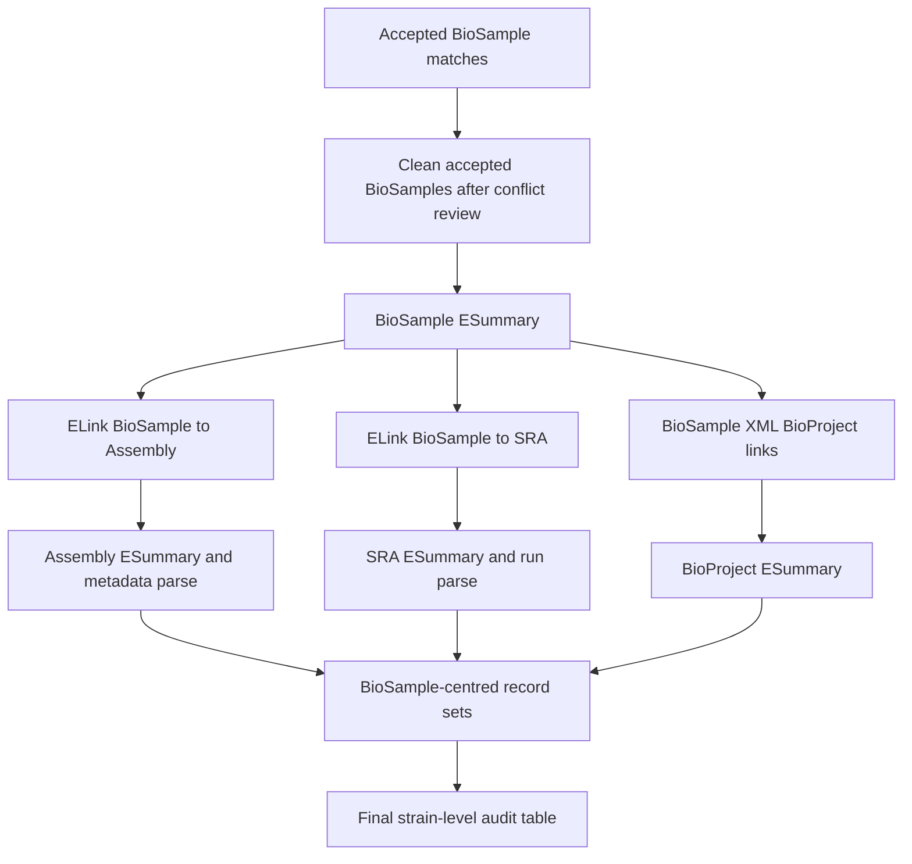

# Project Management, Open-Source Architecture, And NCBI Database Matching Roadmap

本文档从项目管理、GitHub 开源治理、代码架构和下一步数据库匹配四个角度，整理当前 NCPPB Xanthomonas genome audit 项目还需要提升的地方。重点是把已有 BioSample workflow 推进成可维护、可复跑、可公开审阅的研究软件项目。

当前日期：2026-06-01。

## 1. 当前状态判断

当前项目已经完成了重要的 exploratory 到 pipeline 初版的转换：

- NCPPB Xanthomonas master table 已有 898 strains。
- BioSample raw harvest 已有全量结果：33,829 raw rows。
- script 11 已给出 612 accepted BioSample rows，覆盖 370 strains。
- script 13 已从 accepted BioSample 扩展到 SRA、BioProject、BioCollections，当前 linked table 有 552 rows，覆盖 370 strains。
- script 14 和 script 15 已经把 rejected result 用于关键词诊断，指出 `[All Fields]` 和短编码 prefix 是主要噪声来源。

但从最终交付角度看，项目还没完成：

- 还没有把 BioSample、SRA、BioProject、Assembly 统一成 final strain-level audit table。
- script 13 还未扩展 Assembly，因此不能可靠区分 complete genome、chromosome-level assembly、draft assembly、reads-only。
- README 仍主要描述 first-30 pilot，与当前 full-scale 状态不一致。
- 没有 `.github/` templates、GitHub Actions、贡献指南、许可证、引用文件等开源治理文件。
- 脚本仍是 numbered scripts 风格，适合研究推进，但长期维护和外部复跑会越来越困难。

## 2. 项目管理层面的提升

### 2.1 把工作拆成 milestone，而不是继续堆脚本

建议设 5 个明确 milestone：

1. **M1 BioSample precision hardening**
   - 用 `analysis_tmp/biosample_raw_audit/` 的 recommendations 回写 query policy。
   - strict profile pilot rerun，证明不丢失关键 accepted matches。
   - 处理 3 条 conflicting accepted rows。

2. **M2 Linked NCBI records**
   - 扩展 BioSample -> Assembly。
   - 稳定 BioSample -> SRA、BioProject。
   - 引入 request cache、resume、run manifest。

3. **M3 Final strain audit table**
   - 每个 NCPPB strain 一行。
   - 输出 best category、record set evidence、manual review flag。
   - 对 proposal categories 做完整覆盖。

4. **M4 Manual review package**
   - curator review tables。
   - false-negative rescue candidates。
   - conflicting identifiers。
   - taxon-only candidates。

5. **M5 Public release candidate**
   - README、LICENSE、CITATION、CONTRIBUTING、CI、release notes。
   - 冻结 data snapshot 和 output schema。
   - 生成 figures 和 summary statistics。

### 2.2 为每次 pipeline run 写 manifest

现在很多结果文件来自不同阶段和不同策略。建议每次正式运行都输出一个 manifest，例如：

```text
results/runs/2026-06-01_biosample_strict_xanthomonas/run_manifest.json
```

manifest 应记录：

- run id 和时间。
- git commit 或 working tree dirty 状态。
- 输入文件路径、行数、sha256。
- NCBI query profile、retmax、max ids、target organism。
- NCBI request cache 路径。
- 输出文件路径、行数、sha256。
- 测试命令和结果。
- 人工审阅状态：`not_reviewed`、`in_review`、`approved`、`superseded`。

这样项目以后可以区分 exploratory outputs、reviewed outputs 和 release outputs。

### 2.3 区分结果成熟度

建议用目录或文件命名区分三类结果：

- `analysis_tmp/`：可删除、可重跑的探索分析。
- `results/refactored_pipeline/`：当前 pipeline 产物，但未必人工审阅。
- `results/release_candidate/<run_id>/`：准备提交给导师或论文补充材料的稳定产物。

同时在 output 表中增加 `review_status` 或在 manifest 中记录：

- `generated_not_reviewed`
- `algorithmic_accept`
- `manual_review_required`
- `manual_accept`
- `manual_reject`
- `superseded_by_run_id`

### 2.4 数据质量 gate

每个 milestone 应有明确 gate：

- BioSample gate：strict query 不使用 `[All Fields]`；confirmed accepted matches 不明显下降；非 Xanthomonas raw rows 大幅下降。
- Linked-record gate：每个 accepted BioSample 的 Assembly/SRA/BioProject link 有 status；失败记录可 resume。
- Final audit gate：898 strains 都出现在 final table；每个 category 有明确定义；ambiguous rows 可追溯到 review table。
- Release gate：tests pass；README 与当前结果一致；schema 文档更新；没有 API key、缓存敏感信息或临时大文件误入版本控制。

## 3. GitHub 开源管理建议

当前要求是人工审阅前不要上传 GitHub。进一步约束是：任何 GitHub commit、push、pull request、release、artifact upload 或仓库设置变更，都必须经过额外人工审核并明确批准。下面建议都只是在本地准备，不等于现在 commit 或 push。

### 3.1 必备仓库文件

建议在人工审阅后补齐：

- `LICENSE`：需要根据导师/机构要求选择。若要开放代码但不开放数据，代码和数据许可应分开写清楚。
- `CITATION.cff`：方便他人引用 workflow、dataset snapshot 或论文。
- `CONTRIBUTING.md`：说明如何运行测试、如何添加新数据库匹配模块、如何提交 issue。
- `CODE_OF_CONDUCT.md`：如果仓库面向公开协作，建议加入。
- `SECURITY.md`：说明不要提交 NCBI API key、浏览器 session、个人路径、未公开数据。
- `.github/ISSUE_TEMPLATE/bug_report.yml`
- `.github/ISSUE_TEMPLATE/data_curation.yml`
- `.github/ISSUE_TEMPLATE/database_matching.yml`
- `.github/PULL_REQUEST_TEMPLATE.md`

### 3.2 GitHub labels

建议预设 labels：

- `area:catalogue-import`
- `area:identifier-extraction`
- `area:ncbi-biosample`
- `area:ncbi-sra`
- `area:ncbi-bioproject`
- `area:ncbi-assembly`
- `area:final-audit`
- `type:bug`
- `type:data-curation`
- `type:method-change`
- `type:docs`
- `review:manual-needed`
- `risk:false-positive`
- `risk:false-negative`
- `priority:blocking-release`

这样可以把导师要求的 rejected result analysis、curator review、database expansion 变成可跟踪 issue，而不是散落在聊天记录和临时 TSV 中。

### 3.3 分支和保护策略

建议：

- `main`：只放人工审阅后的稳定结果。
- `develop` 或 `workflow-next`：整合下一阶段 pipeline 改动。
- feature branches：`codex/<short-task>` 或 `feature/<short-task>`。
- main branch protection：至少要求 tests pass，禁止直接 push。
- release tags：`v0.1-biosample-audit`、`v0.2-linked-records`、`v1.0-final-xanthomonas-audit`。

当前不要 push，但可以把这些作为本地治理计划写入 docs。

### 3.4 GitHub Actions CI

建议后续加入 `.github/workflows/test.yml`：

- Python 3.11 / 3.12 matrix。
- `python -m unittest tests.test_ncbi_precision`。
- `python -m py_compile scripts/*.py`。
- 一个 no-network fixture test，保证 CI 不需要 NCBI 网络。

不要在 CI 中运行 full NCBI harvest。NCBI live calls 应作为 manual workflow 或 release run，本地带 cache 执行。

### 3.5 开源数据策略

需要明确哪些能公开：

- 可以公开：代码、规则、schema、已保存 NCPPB HTML/CSV 是否可公开需确认来源条款。
- 谨慎公开：NCBI raw results 通常来自公共数据库，但仍建议标注 retrieval date 和 query profile。
- 不应公开：API key、浏览器 session、个人路径、未审阅人工判断。

建议最终 release 中提供：

- `data/raw/README.md`：说明 NCPPB source snapshot 获取方式。
- `results/release_candidate/<run_id>/run_manifest.json`。
- `docs/data_dictionary.md` 更新后的 schema。
- final audit TSV 和 summary statistics。

## 4. 项目架构改进建议

### 4.1 从 numbered scripts 逐步迁移到 package + CLI

当前 numbered scripts 对快速推进有用，但后续会出现重复代码：CSV 读写、Entrez client、identifier pattern、evidence classification、record grouping。建议逐步引入 package：

```text
ncppb_audit/
  __init__.py
  io.py
  catalogue.py
  identifiers.py
  query_policy.py
  ncbi/
    entrez.py
    biosample.py
    sra.py
    bioproject.py
    assembly.py
  matching/
    evidence.py
    identifiers.py
    taxonomy.py
  audit/
    raw_candidates.py
    record_sets.py
    final_table.py
  reports/
    summary_stats.py
```

保留 `scripts/` 作为 CLI wrapper，例如：

```text
scripts/10_harvest_biosample_raw.py -> 调用 ncppb_audit.ncbi.biosample
scripts/15_audit_biosample_raw_candidates.py -> 调用 ncppb_audit.audit.raw_candidates
```

这样不会一次性大改，但能减少未来维护成本。

### 4.2 引入配置文件

建议增加：

```text
config/xanthomonas_biosample_strict.yml
config/full_ncppb_template.yml
```

内容包括：

- target organism filter。
- query profiles。
- prefix policy：`keep_strict_profile`、`fallback_only`、`disable_default`。
- Entrez delay、retmax、max ids。
- input/output paths。
- manual review policy。

这样未来扩展全 NCPPB 时，不需要改代码，只需要按 organism group 或 batch 改 config。

### 4.3 输出 schema 固定化

建议把关键输出 schema 写入 `docs/data_dictionary.md`，至少覆盖：

- identifier candidate table。
- BioSample raw table。
- BioSample match/review table。
- raw audit output。
- linked database output。
- record set table。
- final strain audit table。

schema 固定后，测试可以检查列名，避免后续脚本互相破坏。

### 4.4 缓存和 resume 应变成统一基础设施

script 10 已有 cache/resume。script 13 还没有统一 cache。下一步所有 NCBI calls 应共享：

```text
.cache/ncbi/<db>/<endpoint>/<sha256>.json
```

并支持：

- 请求去重。
- partial failure resume。
- request count summary。
- cache hit summary。
- manifest 记录 cache path。

这对全 NCPPB 扩展非常重要。

## 5. 下一步数据库匹配怎么完成

下一步不应直接 broad search SRA/Assembly，而应以 accepted BioSample 为中心扩展 linked records。原因是 BioSample 是 strain metadata hub；SRA、Assembly、BioProject 单独 search 很容易返回同物种但不同 strain 的记录。

推荐路线：



### 5.1 Phase A: 清理 BioSample accepted set

输入：

- `results/refactored_pipeline/04_biosample_matches_all.tsv`
- `analysis_tmp/biosample_raw_audit/raw_candidate_audit.tsv`
- `analysis_tmp/biosample_raw_audit/false_negative_rescue_candidates.tsv`

操作：

- 把 script 15 标记的 3 条 conflicting accepted rows 移到 manual review。
- 对 accepted BioSample 去重：同一 NCPPB + BioSample accession 保留一行。
- 保留 evidence columns：matched identifier、rule name、query source、search term。

输出建议：

```text
results/refactored_pipeline/06_biosample_matches_curated.tsv
results/refactored_pipeline/06_biosample_manual_review_required.tsv
```

### 5.2 Phase B: Assembly matching

script 13 当前缺口是 Assembly。建议在下一个 linked-record script 中加入：

1. `ELink(dbfrom='biosample', db='assembly', id=biosample_uid)`。
2. 对 assembly UIDs 运行 `ESummary(db='assembly')`。
3. 解析字段：
   - Assembly accession：`GCA_...` / `GCF_...`
   - BioSample accession
   - BioProject accession
   - organism
   - taxid
   - assembly level：Complete Genome / Chromosome / Scaffold / Contig
   - submitter / submitter organization
   - release date / latest date
   - FTP or download URL if available
4. 只有 linked accepted BioSample 的 Assembly 才进入 confirmed linked record。
5. 如果 Assembly organism/taxid 与 BioSample 不一致，保留但标记 `taxonomy_warning`。

输出列建议：

```text
assembly_uids
assembly_accessions
assembly_refseq_accessions
assembly_levels
assembly_statuses
assembly_submitters
assembly_release_dates
assembly_ftp_paths
assembly_taxonomy_warnings
```

### 5.3 Phase C: SRA matching

script 13 已能解析 SRA experiment/run/library strategy，但需要更结构化：

- 保留 experiment accessions：`SRX/ERX/DRX`。
- 保留 run accessions：`SRR/ERR/DRR`。
- 保留 library strategy：WGS、AMPLICON、RNA-Seq 等。
- 判断是否能支持 `reads_only`：有 SRA WGS reads，但没有 linked Assembly。
- 不把 non-WGS SRA 自动作为 genome evidence；应标记为 `other_sequence_data` 或 review。

### 5.4 Phase D: BioProject matching

BioProject 不能单独作为 strain-level evidence。它只说明项目层级上下文，必须通过 accepted BioSample、Assembly 或 SRA link 支持。

需要输出：

- BioProject accession。
- project title。
- linked source：BioSample XML、SRA summary、Assembly summary、ELink。
- 如果一个 BioProject 包含多个 strains，不应把项目内所有 records 推回到同一个 NCPPB strain。

### 5.5 Phase E: Record set table

record set 应以 BioSample accession 为中心：

```text
record_set_id = biosample_accession
```

每行代表一个 confirmed BioSample-centred record set。建议输出：

- `ncppb_number`
- `record_set_id`
- `biosample_accession`
- `matched_identifier`
- `organism`
- `taxid`
- `assembly_accessions`
- `assembly_levels`
- `sra_experiment_accessions`
- `run_accessions`
- `sra_library_strategies`
- `bioproject_accessions`
- `best_data_category`
- `evidence_score`
- `evidence_notes`
- `taxonomy_warning`
- `manual_review_flag`

### 5.6 Phase F: Final strain-level audit table

最终交付的核心表应一行一个 NCPPB strain，覆盖全部 898 rows。

建议列：

```text
ncppb_number
current_name
name_as_received
alternative_names
host
country
confirmed_record_sets
best_audit_category
has_biosample
has_assembly
has_sra
has_bioproject
best_assembly_level
biosample_accessions
assembly_accessions
sra_experiment_accessions
run_accessions
bioproject_accessions
matched_identifiers
evidence_summary
manual_review_status
manual_review_reason
false_positive_risk
false_negative_risk
query_policy_notes
```

category 规则：

1. linked Assembly level contains Complete Genome -> `complete_genome_available`
2. linked Assembly level contains Chromosome -> `chromosome_level_assembly_available`
3. linked Assembly level contains Scaffold/Contig -> `draft_assembly_available`
4. linked WGS SRA exists and no Assembly -> `reads_only`
5. accepted BioSample exists but no SRA/Assembly -> `biosample_metadata_only`
6. no accepted records and no strong rescue -> `no_confidently_linked_public_sequence_data`
7. conflicting identifier / taxon-only / low-confidence rescue -> `ambiguous_case_needing_curator_review`

## 6. 推荐新增或重构脚本

短期可以继续用 `scripts/`，但命名要明确：

- `scripts/16_apply_query_policy.py`
  - 读取 `prefix_keyword_recommendations.tsv`。
  - 生成 strict/default/fallback query plan。

- `scripts/17_expand_biosample_linked_databases.py`
  - 替代或扩展 script 13。
  - 支持 Assembly、SRA、BioProject。
  - 支持 cache/resume。

- `scripts/18_build_ncbi_record_sets.py`
  - 以 BioSample 为中心合并 linked records。

- `scripts/19_build_final_strain_audit.py`
  - 生成 898-row final audit table。

- `scripts/20_make_summary_statistics.py`
  - 生成 summary tables 和 figures。

后续重构时，再把这些 CLI 背后的逻辑迁移进 `ncppb_audit/` package。

## 7. 近期执行顺序

建议下一阶段按这个顺序推进：

1. 更新 README，使其不再停留在 first-30 pilot。
2. 额外人工审核前，不 commit、不 push、不建 PR、不上传 GitHub release/artifact。
3. 用 script 15 的 recommendations 生成 query policy table。
4. 对 3 条 conflicting accepted rows 做 review package。
5. 实现 Assembly expansion。
6. 生成 `07_linked_records_all_databases.tsv`。
7. 生成 `08_record_sets_all.tsv`。
8. 生成 `09_final_strain_audit.tsv`。
9. 根据 final audit table 做 summary statistics。
10. 再准备 GitHub governance files 和 release candidate。

## 8. 当前最重要的项目风险

- **假阳性风险**：短编码和 `[All Fields]` 会把无关 records 拉入 raw data。已经通过 script 15 开始控制。
- **假阴性风险**：过严 query 可能漏掉 metadata 写法不标准的 records。应通过 fallback-only rescue candidates 小批量人工回查，而不是恢复 broad search。
- **Assembly 缺口**：没有 Assembly 就不能完成 proposal category。
- **README/文档滞后**：对外开源前必须更新，否则外部用户会误以为项目仍在 first-30 阶段。
- **结果可追溯性不足**：需要 run manifest 和稳定 output schema。
- **NCBI rate-limit/可复跑风险**：全 NCPPB 扩展前必须统一 cache/resume。

## 9. 结论

项目下一步的核心不是继续扩大 broad search，而是把已确认的 BioSample evidence 作为可信锚点，向 Assembly、SRA、BioProject 扩展，再回到 strain-level final audit。GitHub 开源管理上，当前最需要补的是 README 更新、治理文件、CI、issue templates、release/run manifest 和 data publication policy。项目架构上，当前 numbered scripts 应逐步迁移到 package + CLI + config + schema 的结构，避免后续数据库匹配越来越难维护。
